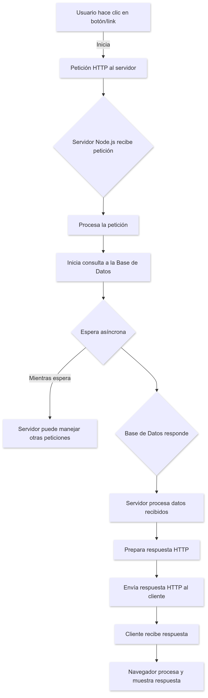
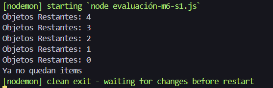

## Evaluación Modulo 6 sesión 1

#### 1. INSTRUCCIONES:

**Considerando los conocimientos respecto a las peticiones HTTP, el modelo cliente servidor, y entendiendo que Node js puede tener la funcionalidad de servidor http.**

**Dibuja un diagrama de flujo, partiendo desde que un usuario inicia una petición HTTP al servidor (desde el clic en un botón o link), hasta la respuesta del servidor de vuelta al usuario.** 
**Considera en él, que la petición hace una llamada a la base de datos, y que ésta puede tardar un tiempo, por lo tanto, también debes especificar los pasos que ocurren durante la acción.**
**Incluir:**

- **Acción de usuario o cliente.**
- **Petición HTTP.**
- **Recepción en servidor.**
- **Consulta a base de datos.**
- **Código que involucra la espera de la respuesta.**
- **Recepción de Respuesta HTTP.**

<br>



<br>

#### 2. REVISIÓN DE CICLOS Y ARRAY METHODS DE JAVASCRIPT

- **En este punto utilizaremos el Array resultante del ejercicio de comprobacón module 6 sesion 1**:
  
    ```javascript
    //Utilizamos el array resultante del ejercicio de comprobación
    var mascotasJson = [
        {
            "nombre": "fluffy",
            "mascota": true,
            "animal": "gato",
            "edadHumana": 7
        },
        {
            "nombre": "Balto",
            "mascota": true,
            "animal": "perro",
            "edadHumana": 11
        },
        {
            "nombre": "Mandibulas",
            "mascota": false,
            "animal": "tiburon",
            "edadHumana": 50
        },
        {
            "nombre": "chispas",
            "mascota": true,
            "animal": "gato",
            "edadHumana": 21
        },
        {
            "nombre": "cariñosito",
            "mascota": false,
            "animal": "oso",
            "edadHumana": 30
        }
    ];
    ```
- **Luego utilizaremos un ciclo for para que en cada interación elimine un elemento del array de objetos:**

    ```javascript
    //Inicializa i con la longitud del array y decrementa en cada iteración
    for (let i = mascotasJson.length; i > 0; i-- ){ 
        //elimina el ultimo elemento del array
        mascotasJson.pop(); 
        //muestra cuántos objetos quedan
        console.log('Objetos Restantes: ' + (i-1));
    }
        //muestra el mensaje cuando no quedan elementos
    console.log('Ya no quedan items');
    ```
- **obteniendo el siguiente resultado en consola**:

    

